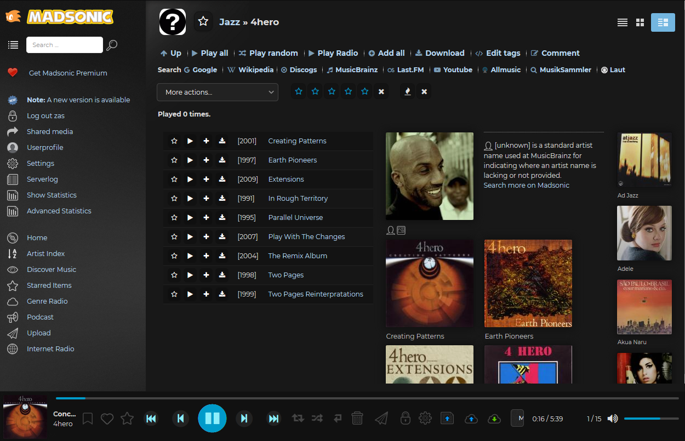

========
Subsonic
========

.. contents:: :local:

(Sub)Madsonic is a free, web-based media streamer, providing ubiquitous access to your music. Use it to share your music with friends, or to listen to your own music while at work. You can stream to multiple players simultaneously, for instance to one player in your kitchen and another in your living room.

(Sub)Madsonic is designed to handle very large music collections (hundreds of gigabytes). Although optimized for MP3 streaming, it works for any audio or video format that can stream over HTTP, for instance AAC and OGG. By using transcoder plug-ins, (Sub)Madsonic supports on-the-fly conversion and streaming of virtually any audio format, including WMA, FLAC, APE, Musepack, WavPack and Shorten.

If you have constrained bandwidth, you may set an upper limit for the bitrate of the music streams. (Sub)Madsonic will then automatically resample the music to a suitable bitrate.

   Madsonic Webinterface

Installation
============

For installation instructions see also `here <https://beta.madsonic.org/pages/help.jsp>`_. My madsonic configuration can be see in the config repo: :config_repo:`madsonic config <tree/master/config/madsonic>`

Install Java
------------

.. code-block:: bash

   sudo apt-get install openjdk-8-jre

Install Madsonic
----------------

There are 2 good Subsonic versions. The official subsonic version, very stable, fast and reliable and the MadSonic Mod from MadEvil. It has several improvements and feature additions.

* Download the `Subsonic .deb <http://www.subsonic.org/pages/download.jsp>`_ package and install it:

.. code-block:: bash

   sudo dpkg -i subsonic-x.x.deb

* Download the `MadSonic .deb <http://beta.madsonic.org/pages/download.jsp>`_ package and install it:

.. code-block:: bash

   sudo dpkg -i Madsonic-x.x.xxxx.deb

* Test the system on a local browser with the address http://localhost:4040

Configuration and Service
=========================

* Log into change the admin password first
* Recommended to change advanced settings as well, like Java Memory, Port Number, Startup Settings

  * Edit the SUBSONIC_ARGS variable in ``/etc/default/subsonic`` or ``/etc/default/madsonic``

* Restart the service

  .. code-block:: bash

     sudo service subsonic restart
     # or
     sudo service madsonic restart

Add Transcoding
---------------

In order that Subsonic can use the powerful `transcoding <https://beta.madsonic.org/pages/transcoding.jsp>`_ feature you need to install some third-party transcoders:

  .. code-block:: bash

   sudo apt-get install lame flac faad vorbis-tools

If somethings goes wrong
------------------------

Check the logs in ``/var/madsonic``.

Jukebox
=======

In order to get the Jukebox to work, the soundcard needs to be set up first.

The user that is running (Sub)Madsonic needs to have access to the soundcard. For Ubuntu this means adding that user to the ``audio`` group in ``/etc/group``.

.. code-block:: bash

   useradd -G audio username

Selecting the Soundcard
-----------------------

First you need to find out what your soundcards are named in the sound library used in Java.

Create the following file

.. code-block:: java
   :caption: audioDevList.java
   :linenos:

   import java.io.*;
   import javax.sound.sampled.*;

   public class audioDevList{
     public static void main(String args[]){

       //Get and display a list of
       // available mixers.

       Mixer.Info[] mixerInfo = AudioSystem.getMixerInfo();
       System.out.println("Available mixers:");
       for(int cnt = 0; cnt < mixerInfo.length;cnt++){
         System.out.println(mixerInfo[cnt].
         getName());
       }
     }
   }

And then run

.. code-block:: bash

   javac audioDevList.java
   java audioDevList

If you get an error about javac not found, you need to install the JDK (e.g. openjdk-8-jdk).

.. code-block:: bash

   sudo apt-get install openjdk-8-jdk

Here is a sample output of the script:

.. code-block::

   Available mixers:
   NVidia [plughw:0,3]
   NVidia [plughw:0,7]
   NVidia [plughw:0,8]
   NVidia [plughw:0,9]
   Intel [plughw:1,0]
   CX8801 [plughw:2,0]
   Port NVidia [hw:0]
   Port Intel [hw:1]
   Port CX8801 [hw:2]

</code>
Linux / Mac : Modify your ``/usr/bin/subsonic/subsonic_run.sh`` (for Ubuntu package install) and add the following line. Note the single quotes and the hash mark ``#`` before the sound card name. Those are required.

.. code-block:: java

   '-Djavax.sound.sampled.SourceDataLine=#PCH [plughw:0,0]' \

Restart the subsonic service

.. code-block:: bash

     sudo service subsonic restart
     # or
     sudo service madsonic restart

Once Music is played in jukebox mode the audio is not available anymore to other programs. To cut this restart sub/madsonic as above shown.
