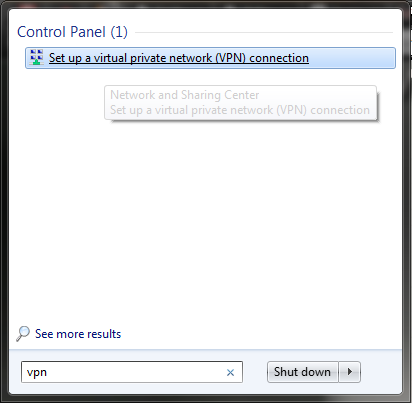
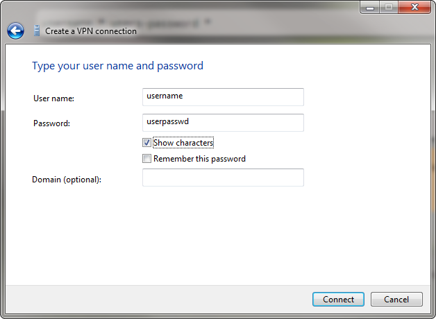
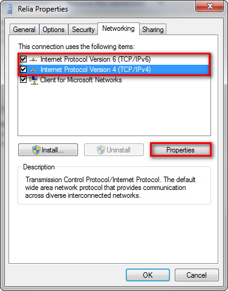
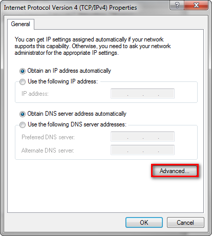

===========================
VPN Virtual Private Network
===========================

A virtual private network (VPN) extends a private network across a public network, such as the Internet. It enables a computer to send and receive data across shared or public networks as if it were directly connected to the private network, while benefiting from the functionality, security and management policies of the private network. This is done by establishing a virtual point-to-point connection through the use of dedicated connections, encryption, or a combination of the two.

There exist many different VPN protocols such as PPTP, OpenVPN, L2TP, SSTP.
In this section We will set-up and connect a VPN connection using the PPTP protocol.

VPN Server Outgoing (Linux)
===========================

Install
-------

.. code-block:: bash

   sudo apt-get install pptpd

Config
------

Add the following lines in your ``etc/pptpd.conf``

.. code-block:: bash
   :caption: /etc/pptpd.conf

   localip  192.168.1.5         # IP of your server hosting VPN
   remoteip 192.168.1.234-1.238 # Range of IP to use for connected machines

Add the following lines to configure ``pptpd`` in ``/etc/ppp/pptpd-options``

.. code-block:: bash
   :caption: /etc/ppp/pptpd-options

   ms-dns 192.168.1.1        # IP of your DNS Server
   nobsdcomp
   noipx
   mtu 1490
   mru 1490

add users to the ``/etc/ppp/chap-secrets`` file, you can add as many users as you like

.. code-block:: bash
   :caption: /etc/ppp/chap-secrets

   username * users-password *

Start VPN
---------
Start / Restart the VPN Deamon to activate the config

.. code-block:: bash

   sudo /etc/init.d/pptpd restart

.. important::

   Note that the connection can only access the server itself and not beyond it. Enable forwarding to avoid this.

Enable Forwarding
-----------------

This step is optional. It is needed to give the connected machine access beyond the server.

By enable forwarding  the entire network will be available to the connected machine not just the VPN server itself.

Edit the ``/etc/sysctl.conf`` and change to following parameter from ``0`` to to ``1``

.. code-block:: bash
   :caption: /etc/sysctl.conf

   net.ipv4.ip_forward=1

To active the setting either restart the server or run the command:

.. code-block:: bash

   sudo sysctl -p

VPN client Incoming (Win 7)
===========================

See the print screens to how to setup the VPN incoming connection on Windows 7.

.. note::

   If VPN is setup by default to relay all traffic through the VPN connection. To avoid this you need to uncheck.

   Start VPN setup

.. figure:: img/vpn_2.png
   :align: center
   :width: 500px

   Configure machine to connect to

   Configure user credentials

   Change IPv4 and ipv6 properties

   Goto advanced properties

.. figure:: img/vpn_6.png
   :align: center
   :width: 300px

   Uncheck user default gateway

:tag:`os`
:tag:`linux`
:tag:`tools`
:tag:`vpn`